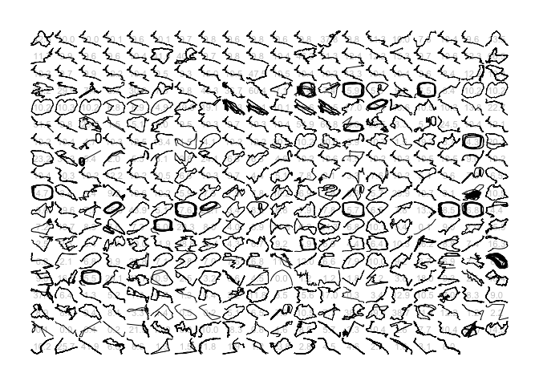
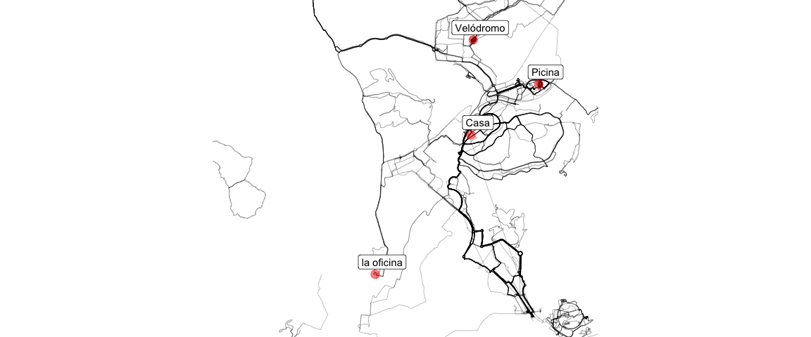

# WORK IN PROGRESS

# Resumen de todas las trazas

De Strava podemos extraer todas las trazas e mltiples deportes o actividades, aqui estan las de mi base de datos. En realidad por ahora faltan los ultimos años ya que ha cambiado la forma de exportar la data de Strava, y tengo que transformar los .FIT que exporta masivamente Strava a GPX. solo un poco de paciencia.

<!-- -->

# Heat map

## Madrid

En el siguiente mapa se puede ver un heat map de algunas de mis actividades en Madrid.  

 
<!-- -->
  
  
